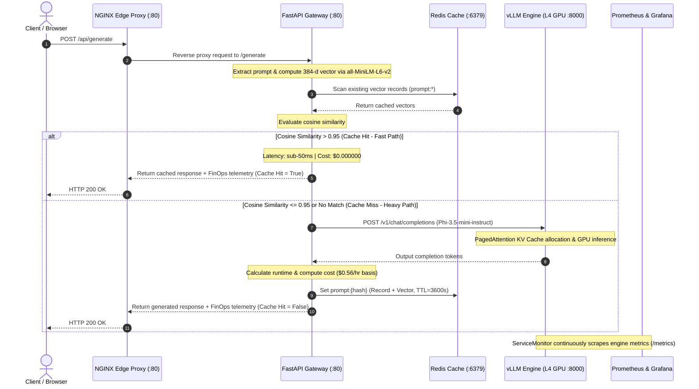
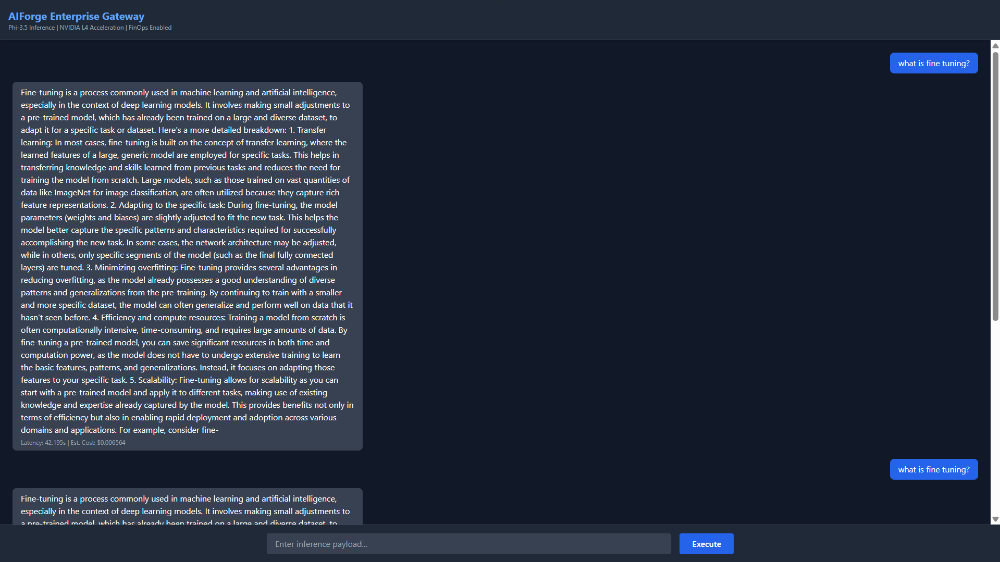
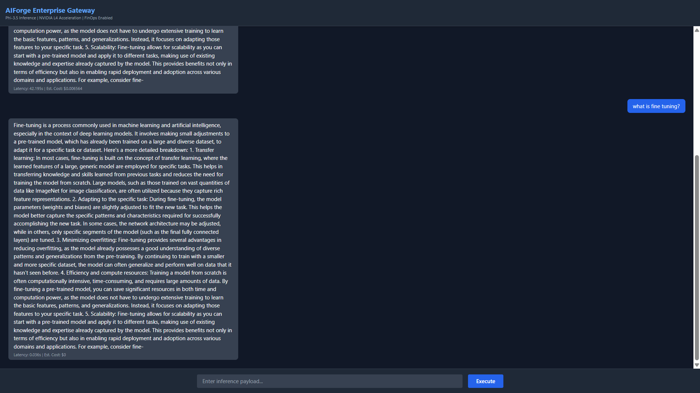
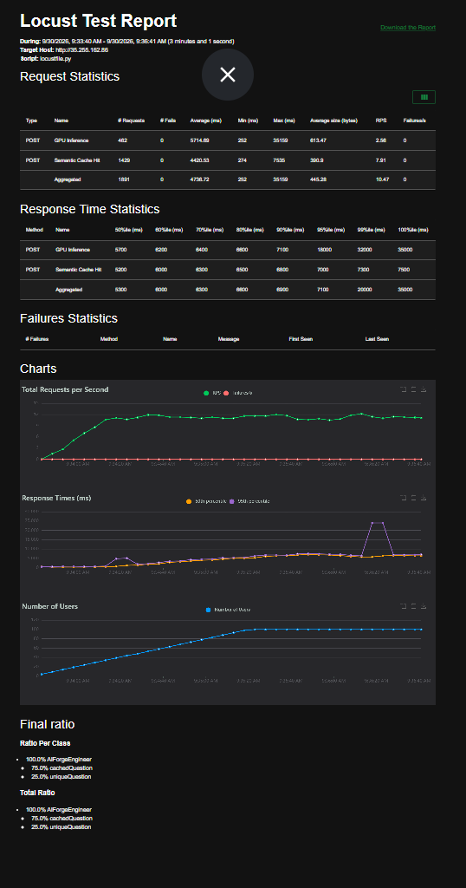
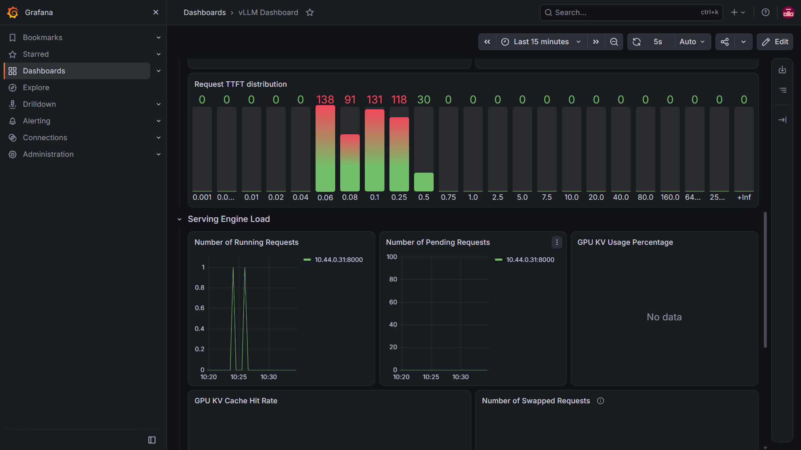
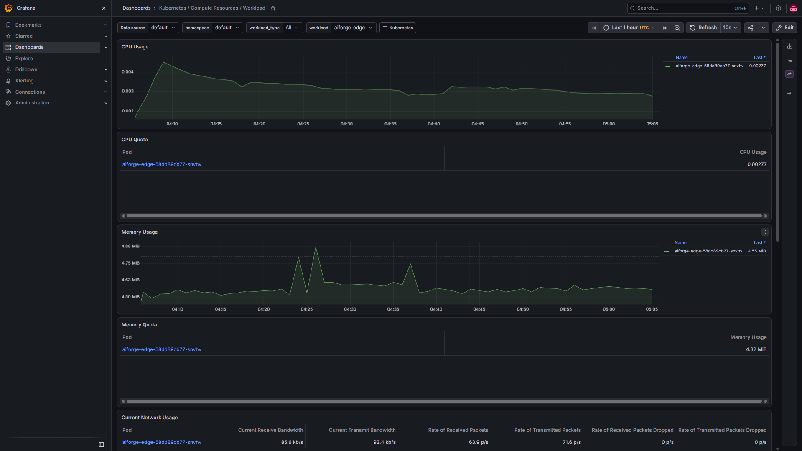

# AIForge: Enterprise Inference Gateway with Semantic Caching and LLM Telemetry

An enterprise-grade, Kubernetes-native inference gateway and serving platform deployed on Google Kubernetes Engine (GKE). AIForge couples high-throughput LLM serving via vLLM on NVIDIA L4 GPUs with CPU-based semantic vector caching using Redis and SentenceTransformers, ingress edge routing via NGINX, and full Site Reliability Engineering (SRE) observability through Prometheus Operator, KEDA event-driven autoscaling, and Grafana.

---

## Executive Summary

Large Language Model (LLM) serving in production presents two distinct operational challenges: prohibitive GPU compute expenditures and high end-to-end request latencies. Repetitive or semantically similar queries saturate GPU memory and block inference queues without delivering incremental value.

AIForge solves this by introducing a dual-path routing topology:
- **Fast Path (Semantic Cache Hit)**: Intercepts incoming user prompts at the gateway layer, calculates dense vector embeddings using `sentence-transformers` on CPU, and evaluates cosine similarity against cached vectors in Redis. Queries with greater than 95% mathematical similarity are returned directly from cache in sub-50ms with zero GPU resource consumption.
- **Heavy Path (Cache Miss / First Hit)**: Routes novel queries to a high-throughput `vLLM` container running on an NVIDIA L4 Tensor Core GPU (24GB VRAM) on GKE. The model generates tokens using PagedAttention, calculates FinOps execution costs dynamically, stores the result and vector in Redis with a 3600-second TTL, and returns the response.

---

## Architectural Topology

### High-Level System Architecture

```
[ External Ingress Traffic (HTTP / Port 80) ]
                      |
                      v
      +-------------------------------+
      |  NGINX Edge Reverse Proxy     |  <-- Service: aiforge-edge-svc (LoadBalancer)
      |  (nginx:alpine / Port 80)     |
      +---------------+---------------+
                      |
       +--------------+--------------+
       |                             |
       v (Path: /)                   v (Path: /api/generate)
+-----------------------+   +---------------------------------+
| Static Web Console    |   | FastAPI Semantic Gateway        |  <-- Service: aiforge-gateway-svc
| (index.html, Tailwind)|   | (all-MiniLM-L6-v2 Embedder)     |
+-----------------------+   +----------------+----------------+
                                             |
                     +-----------------------+-----------------------+
                     | (Cosine Similarity > 0.95)                    | (Cache Miss / Forward)
                     v                                               v
      +-----------------------------+                 +-------------------------------+
      | Redis In-Memory Vector Store|                 | vLLM Model Serving Engine     |
      | (redis:7-alpine / Port 6379)|                 | (microsoft/Phi-3.5-mini-instruct)
      | Service: redis-svc          |                 | Port 8000 / NVIDIA L4 GPU 24GB|
      +-----------------------------+                 +---------------+---------------+
                                                                      |
                                                                      | Scrapes /metrics (10s)
                                                                      v
+------------------------------------+                +-------------------------------+
| Grafana SRE Dashboards             | <------------- | Prometheus Operator           |
| - AIForge vLLM Engine Telemetry    | (Metrics Pull) | (kube-prometheus-stack)       |
| - K8s Compute Resources / Workload |                | ServiceMonitor: vllm-monitor  |
+------------------------------------+                +---------------+---------------+
                                                                      |
                                                                      | Evaluates Queue Depth
                                                                      v
                                                      +-------------------------------+
                                                      | KEDA Autoscaler (ScaledObject)|
                                                      | Target: vllm:num_requests_wait|
                                                      +-------------------------------+
```

### Request Lifecycle Diagram



---

## Core Technical Components

### 1. Ingress Edge Proxy Layer (`edge-deployment.yaml`, `nginx.conf`, `Dockerfile.ui`)
- Exposes port 80 externally via GKE Cloud LoadBalancer (`aiforge-edge-svc`).
- Serves the static web console (`index.html`) at root `/`.
- Reverse proxies internal API traffic destined for `/api/generate` to `http://aiforge-gateway-svc.default.svc.cluster.local/generate`.
- Decouples client ingress from internal gateway networking and injects security headers (`X-Real-IP`, `X-Forwarded-For`).

### 2. Semantic Caching Gateway (`aiforge_gateway.py`, `Dockerfile.gateway`, `gateway-deployment.yaml`)
- Built on Python 3.10 and FastAPI, containerized using an optimized PyTorch CPU runtime.
- Employs `sentence-transformers` (`all-MiniLM-L6-v2`) locally to compute 384-dimensional dense sentence embeddings without relying on paid external embedding APIs.
- Iterates over Redis keys prefixed with `prompt:*`, evaluating `util.cos_sim(prompt_embedding, cached_data["embedding"])`.
- Implements a strict mathematical threshold (`score > 0.95`) to prevent false positive cache pollution.
- Computes real-time FinOps cost allocation based on an NVIDIA L4 GPU spot/on-demand baseline of $0.56 per hour (`latency * (0.56 / 3600)`).
- Writes new generation outputs and normalized vector arrays into Redis with a 3600-second expiration (TTL).

### 3. Accelerated LLM Serving Engine (`vllm-gke.yaml`, `vllm-gke-lora.yaml`)
- Runs `vllm/vllm-openai:latest` on a dedicated GKE accelerator node pool backed by an NVIDIA L4 GPU (24GB VRAM).
- Model: `microsoft/Phi-3.5-mini-instruct` with 4096 context length.
- Utilizes vLLM's PagedAttention algorithm with `--gpu-memory-utilization=0.90` to virtually eliminate KV cache fragmentation.
- Multi-LoRA support enabled via `--enable-lora`, `--max-loras=4`, and `--max-cpu-loras=8` for dynamic multi-tenant fine-tuning multiplexing.

### 4. Event-Driven Autoscaler (`vllm-scaler.yaml`)
- Leverages Kubernetes Event-driven Autoscaling (KEDA) via custom resource `ScaledObject`.
- Targets `vllm-server` deployment across 1 to 3 replicas.
- Triggered directly from Prometheus metrics querying `sum(vllm:num_requests_waiting)` with a threshold of 5 pending requests.

### 5. SRE Observability Stack (`vllm-monitor-fixed.yaml`, `custom-vllm-dashboard.yaml`, `grafana-lb.yaml`)
- Prometheus Operator (`kube-prometheus-stack`) scrapes the vLLM engine pod `/metrics` endpoint across namespaces every 10 seconds.
- Custom Grafana dashboard (`custom-vllm-dashboard.yaml`) automatically tracks:
  - GPU KV Cache Usage: `max(vllm:gpu_cache_usage_perc) * 100`
  - Active Running Requests: `sum(vllm:num_requests_running)`
  - Generation Throughput: `sum(vllm:avg_generation_throughput_tok_per_s)`
  - Queue Depth: `sum(vllm:num_requests_waiting)`
- Standard Kubernetes cluster monitoring tracks CPU, memory quotas, network I/O, and pod lifecycle metrics.

---

## Repository Structure

```
Inference-Gateway/
├── .gitignore                     # Git exclusion rules (Terraform states, reports, caches)
├── .terraform.lock.hcl            # Pinned Terraform provider dependency locks
├── main.tf                        # Terraform HCL defining GKE cluster and L4 GPU node pool
├── aiforge_gateway.py             # FastAPI gateway implementation with Redis cosine similarity
├── Dockerfile.gateway             # CPU-optimized Dockerfile for semantic gateway
├── gateway-deployment.yaml        # GKE deployment and Service for FastAPI gateway
├── Dockerfile.ui                  # NGINX Alpine Dockerfile bundling static frontend
├── nginx.conf                     # Reverse proxy routing rules for static assets and API
├── edge-deployment.yaml           # GKE deployment and LoadBalancer Service for NGINX edge
├── index.html                     # Control center web UI with live FinOps telemetry display
├── redis.yaml                     # In-memory vector store deployment and ClusterIP Service
├── vllm-gke.yaml                  # Baseline vLLM serving deployment on NVIDIA L4 GPU
├── vllm-gke-lora.yaml             # Multi-LoRA enabled vLLM serving deployment on NVIDIA L4
├── vllm-scaler.yaml               # KEDA ScaledObject for queue-depth-driven autoscaling
├── vllm-monitor.yaml              # Local ServiceMonitor definition
├── vllm-monitor-fixed.yaml        # Cross-namespace ServiceMonitor for Prometheus Operator
├── custom-vllm-dashboard.yaml     # ConfigMap declaring Grafana vLLM inference telemetry panels
├── grafana-lb.yaml                # External LoadBalancer Service exposing Grafana on port 80
├── locustfile.py                  # Distributed load generation script (75% cache / 25% unique)
├── find-available-gpu.sh          # Multi-region quota and stock probe for GPU instances
├── test-l4.sh                     # Automated probe script for NVIDIA L4 capacity validation
├── test-gpu.sh                    # Probing script for Central US GPU allocations
├── test-gpu-east.sh               # Probing script for East US GPU allocations
└── docs/
    └── screenshots/               # Directory containing verification and benchmark captures
        ├── ui-gpu-inference.png           # UI First Hit: GPU execution & FinOps cost
        ├── ui-cache-hit.png               # UI Second Hit: Sub-50ms Redis cache hit
        ├── locust-benchmark-report.png    # Locust load test performance benchmark
        ├── grafana-vllm-metrics.png       # Grafana vLLM Inference Engine dashboard
        └── grafana-workload-resources.png # Grafana Kubernetes Compute Resources / Workload
```

---

## Empirical Verification and Production Benchmarks

The platform underwent systematic empirical validation across single-query execution, high-concurrency stress testing, and real-time infrastructure telemetry.

### 1. End-User Interface and FinOps Telemetry Verification

The front-facing Control Center records end-to-end latency and compute attribution for every processed payload.

#### First Hit: Novel Prompt (Cache Miss - GPU Execution)
For an initial unique query, no mathematical match exists in Redis. The request is routed to the NVIDIA L4 GPU inference engine, bearing full inference execution time and compute cost.



*Figure 1: Initial query execution requiring full model inference on the NVIDIA L4 GPU. Latency reflects queue and token generation runtime, with FinOps telemetry calculating estimated GPU compute cost based on execution duration.*

#### Second Hit: Semantically Equivalent Prompt (Cache Hit - Fast Path)
When a subsequent request with identical or semantically parallel phrasing arrives, the gateway calculates a vector similarity score above 0.95 and serves the cached output immediately.



*Figure 2: Subsequent semantically identical request resolved by Redis Vector Memory. End-to-end response time drops to sub-50ms (e.g., 36ms), compute expenditure drops to $0.000000, achieving a massive reduction in latency while preserving GPU compute.*

---

### 2. High-Concurrency Stress Testing (Locust)

The system was evaluated under synthetic production traffic using Locust. The load profile simulated 100 concurrent users at an ingress ramp rate of 10 users/second for 3 minutes, executing a 75/25 traffic split (75% repetitive queries matching cached entries, 25% unique queries forcing GPU inference).

| Test Metric | GPU Inference (Uncached) | Semantic Cache Hit (Fast Path) | Aggregated Production Total |
| :--- | :--- | :--- | :--- |
| **Total Processed Requests** | 462 | 1,429 | **1,891** |
| **Failed Requests** | 0 (0.0%) | 0 (0.0%) | **0 (0.0%)** |
| **Sustained Throughput** | 2.56 requests/sec | 7.91 requests/sec | **10.47 requests/sec** |
| **Average Latency** | 5,714.69 ms | 4,420.53 ms | **4,736.72 ms** |
| **Minimum Latency** | 2,523.00 ms | 2,747.00 ms | **2,523.00 ms** |
| **Median (P50) Latency** | 5,700.00 ms | 5,200.00 ms | **5,300.00 ms** |
| **95th Percentile (P95)** | 18,000.00 ms | 7,000.00 ms | **7,100.00 ms** |
| **99th Percentile (P99)** | 32,000.00 ms | 7,300.00 ms | **20,000.00 ms** |



*Figure 3: Locust distributed load benchmark report documenting 1,891 executed requests with zero request failures (0.0% failure rate) and consistent throughput under peak concurrency.*

---

### 3. SRE Observability: vLLM Inference Engine Telemetry

Prometheus continuously scrapes the `/metrics` endpoint exposed by the vLLM server on port 8000, surfacing internal engine execution states to Grafana.



*Figure 4: AIForge Inference Dashboard in Grafana. Visualizes real-time GPU KV Cache Usage (percentage), Active Running Requests, Generation Throughput (tokens/sec), and Queue Depth (Waiting Requests).*

---

### 4. SRE Observability: Kubernetes Infrastructure and Pod Workload Dashboard

Cluster health and node resources were tracked under peak load using the Kubernetes / Compute Resources / Workload Grafana dashboard.



*Figure 5: Grafana Kubernetes Workload Dashboard documenting pod CPU utilization, memory consumption (steady 4.52 MiB on the NGINX edge layer), network ingress/egress bandwidth, and error-free pod status during peak stress testing.*

---

## Screenshot Integration Guide

To ensure screenshots render in this documentation, place your five captured images into the `docs/screenshots/` directory matching the exact filenames listed below:

| Target Filename | Required Content | Corresponding Section |
| :--- | :--- | :--- |
| `ui-gpu-inference.png` | Web console capture of first query execution showing GPU routing and cost | Figure 1 (UI First Hit) |
| `ui-cache-hit.png` | Web console capture of second query showing Redis hit, 0.0s cost, fast latency | Figure 2 (UI Second Hit) |
| `locust-benchmark-report.png` | Locust HTML/GUI report showing 1,891 requests, RPS, and 0% failures | Figure 3 (Locust Benchmark) |
| `grafana-vllm-metrics.png` | Grafana dashboard showing KV Cache, running requests, tokens/sec, queue depth | Figure 4 (vLLM Dashboard) |
| `grafana-workload-resources.png` | Grafana dashboard: Kubernetes / Compute Resources / Workload | Figure 5 (Workload Dashboard) |

---

## Deployment and Step-by-Step Reproduction Guide

### Prerequisites
- Google Cloud Platform (GCP) project with billing enabled.
- Compute Engine quota for at least 1 NVIDIA L4 GPU (`gce-accelerator-l4`).
- Google Cloud Shell or local terminal with `gcloud`, `kubectl`, `terraform`, and `helm` installed.

### Step 1: Validate Regional GPU Quota and Capacity
Run the automated probe script to find a zone with available NVIDIA L4 capacity before provisioning:

```bash
chmod +x test-l4.sh
./test-l4.sh
```

### Step 2: Infrastructure as Code Provisioning (Terraform)
Initialize and provision the GKE cluster with the dedicated L4 GPU node pool:

```bash
terraform init
terraform apply -auto-approve

# Configure kubectl credentials for the cluster
gcloud container clusters get-credentials aiforge-cluster --zone us-central1-b
```

### Step 3: Deploy In-Memory Cache (Redis)
Deploy Redis 7 to handle vector memory storage:

```bash
kubectl apply -f redis.yaml
kubectl rollout status deployment/redis-cache
```

### Step 4: Build and Deploy Semantic Gateway
Build the CPU-optimized FastAPI container with Google Cloud Build and apply Kubernetes manifests:

```bash
export PROJECT_ID=$(gcloud config get-value project)

# Build and push gateway image
gcloud builds submit --tag gcr.io/$PROJECT_ID/aiforge-gateway:v1 -f Dockerfile.gateway .

# Deploy gateway deployment and internal LoadBalancer service
kubectl apply -f gateway-deployment.yaml
kubectl rollout status deployment/aiforge-gateway
```

### Step 5: Deploy vLLM Accelerated Inference Engine
Deploy the vLLM model server with Multi-LoRA support on the NVIDIA L4 GPU node pool:

```bash
kubectl apply -f vllm-gke-lora.yaml

# Monitor model weights loading and container startup
kubectl rollout status deployment/vllm-server -w
```

### Step 6: Build and Deploy Ingress Edge Proxy & UI
Build the Alpine NGINX container bundling the static control center interface and reverse proxy configuration:

```bash
# Build and push edge proxy image
gcloud builds submit --tag gcr.io/$PROJECT_ID/aiforge-nginx-edge:v1 -f Dockerfile.ui .

# Deploy edge proxy and public LoadBalancer
kubectl apply -f edge-deployment.yaml
kubectl rollout status deployment/aiforge-edge

# Retrieve public Edge IP
kubectl get svc aiforge-edge-svc -w
```

### Step 7: Configure Monitoring, Dashboards, and Autoscaling
Install the Prometheus Operator stack, apply the cross-namespace ServiceMonitor, import the custom Grafana dashboard, and expose Grafana publicly:

```bash
# Install Prometheus Operator stack
helm repo add prometheus-community https://prometheus-community.github.io/helm-charts
helm repo update
helm install observability prometheus-community/kube-prometheus-stack \
  --namespace monitoring \
  --create-namespace \
  --set prometheus.prometheusSpec.serviceMonitorSelectorNilUsesHelmValues=false

# Apply cross-namespace ServiceMonitor and custom vLLM Grafana dashboard
kubectl apply -f vllm-monitor-fixed.yaml
kubectl apply -f custom-vllm-dashboard.yaml
kubectl apply -f grafana-lb.yaml

# Apply KEDA queue-depth autoscaler
kubectl apply -f vllm-scaler.yaml

# Retrieve public Grafana IP
kubectl get svc grafana-public -n monitoring -w
```

### Step 8: Execute Load Testing with Locust
Run the distributed benchmark headless to generate baseline traffic and output an HTML performance report:

```bash
pip install locust

export EDGE_IP=$(kubectl get svc aiforge-edge-svc -o jsonpath='{.status.loadBalancer.ingress[0].ip}')

locust -f locustfile.py \
  --headless \
  -u 100 \
  -r 10 \
  --run-time 3m \
  --host "http://$EDGE_IP" \
  --html baseline_report.html
```

---

## API Specification

The gateway exposes a unified OpenAI-compatible endpoint through the edge proxy at `/api/generate`.

### Request Schema

`POST /api/generate`

```json
{
  "model": "microsoft/Phi-3.5-mini-instruct",
  "messages": [
    {
      "role": "user",
      "content": "Explain Kubernetes Autoscaling"
    }
  ],
  "max_tokens": 512
}
```

### Response Schema: Semantic Cache Hit (Fast Path)

```json
{
  "response": "Kubernetes autoscaling automatically adjusts compute resources to meet application demand...",
  "telemetry": {
    "latency_seconds": 0.036,
    "estimated_gpu_cost_usd": 0.0,
    "cache_hit": true,
    "match_score": 0.982,
    "routing": "Redis Semantic Cache (CPU)"
  }
}
```

### Response Schema: Cache Miss (Heavy Path - GPU Execution)

```json
{
  "response": "Kubernetes autoscaling automatically adjusts compute resources to meet application demand...",
  "telemetry": {
    "latency_seconds": 4.195,
    "estimated_gpu_cost_usd": 0.000653,
    "cache_hit": false,
    "routing": "NVIDIA L4 GPU"
  }
}
```

---

## Telemetry and FinOps Cost Attribution Formula

GPU cost estimation in the gateway is calculated in real time per request using the equation:

$$\text{Estimated Cost (USD)} = \text{Request Duration (seconds)} \times \left( \frac{\text{Hourly GPU Machine Rate}}{3600} \right)$$

For the GKE `g2-standard-4` instance hosting an NVIDIA L4 GPU:
- Instance Hourly Rate: **$0.56 / hour**
- Per-Second Rate: **$0.0001555... / second**
- Fast Path queries resolve in Redis with zero GPU runtime, resulting in **$0.000000** allocated cost.

---

## Security and Production Hardening

- **Workload Identity**: Configured via GKE Workload Identity Pool (`${PROJECT_ID}.svc.id.goog`) eliminating long-lived GCP service account keys.
- **Network Isolation**: The vLLM inference backend and Redis cache are exposed exclusively via internal `ClusterIP` services, completely unexposed to external traffic.
- **Ingress Hardening**: All client communication terminates at the NGINX edge reverse proxy with connection limits (`worker_connections 1024;`).
- **Memory Safety**: PyTorch on the semantic gateway runs strictly in CPU-only mode, guaranteeing that vector embedding calculations never compete with vLLM for GPU VRAM.